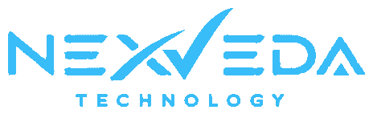

# 🚀 Nexveda Technologies — Premium Company Website

A modern, high-performance, and visually stunning corporate website for **Nexveda Technologies**, crafted with cutting-edge web design aesthetics, smooth GSAP micro-animations, interactive hero particle & light beam canvas, dark/light theme toggle, and a complete contact form backend integration.


---

## ✨ Features & Highlights

- **Dynamic Interactive Canvas**: Custom 2D HTML5 canvas rendering glowing iridescent stream fibers and particle sparks that dynamically respond to cursor movement.
- **Micro-Animations & Smooth Reveal**: Powered by **GSAP (GreenSock)** and **ScrollTrigger** for fluid scroll transitions, staggered card reveals, 3D tilt effects, and interactive elements.
- **Dark & Light Mode**: Seamless theme switcher persisted with `localStorage`.
- **Interactive Team Profile Modal**: Interactive biography modal showcasing detailed technical & design expertise, projects, and credentials.
- **Dual Contact Form Handling**:
  - **Full-Stack Mode (Node.js/Express)**: Saves inquiries into an SQLite database (`data/nexveda.db`) and dispatches email notifications via **Resend API**.
  - **Static Host Mode (GitHub Pages)**: Gracefully falls back to direct client-side `mailto:` dispatch for seamless functionality anywhere without server dependencies.
- **Fully Responsive & SEO Optimized**: Fluid layouts for mobile, tablet, and desktop screens with structured OpenGraph tags and semantic HTML.

---

## 🛠️ Technology Stack

- **Frontend**: HTML5, Vanilla CSS3 (Custom Properties & Glassmorphism), JavaScript (ES6+)
- **Animations**: GSAP (GreenSock) 3.12, ScrollTrigger plugin, 2D HTML5 Canvas API
- **Backend (Optional for full-stack deployment)**: Node.js, Express.js
- **Database**: SQLite3
- **Email Service**: Resend API
- **Fonts**: Google Fonts (*Outfit*, *Plus Jakarta Sans*, *Montserrat*, *Inter*)

---

## 📁 Repository Structure

```text
MY-website/
├── index.html           # Main HTML5 landing page
├── styles.css           # Core design system, glassmorphism & responsive CSS
├── script.js            # Interactive logic, GSAP animations & canvas background
├── server.js            # Node.js Express server & SQLite / Resend API backend
├── package.json         # Project dependencies & npm scripts
├── site.webmanifest     # Web app manifest
├── robots.txt           # Search engine directives
├── sitemap.xml          # Site map index
├── data/                # SQLite database directory (auto-created on server start)
└── images/              # Logos, favicon, icons, and media assets
```

---

## ⚙️ How to Run Locally

### Option 1: Static Mode (No Node.js Required)
Simply open `index.html` in any web browser, or use a live server extension (e.g., Live Server in VS Code).

### Option 2: Full-Stack Mode (With Contact API & Database)

1. **Clone the Repository**:
   ```bash
   git clone https://github.com/MrStark0257/MY-website.git
   cd MY-website
   ```

2. **Install Dependencies**:
   ```bash
   npm install
   ```

3. **Configure Environment Variables (Optional)**:
   Create a `.env` file in the root directory:
   ```env
   PORT=3000
   DB_PATH=./data/nexveda.db
   CONTACT_EMAIL=nexvedatechnologies@gmail.com
   RESEND_API_KEY=your_resend_api_key_here
   ```

4. **Start the Express Server**:
   ```bash
   npm start
   ```

5. **Access the Application**:
   Open [http://localhost:3000](http://localhost:3000) in your browser.

---

## 📬 Contact & Support

- **Email**: [nexvedatechnologies@gmail.com](mailto:nexvedatechnologies@gmail.com)
- **Organization**: Nexveda Technologies

---

*© 2026 Nexveda Technologies. All rights reserved.*
